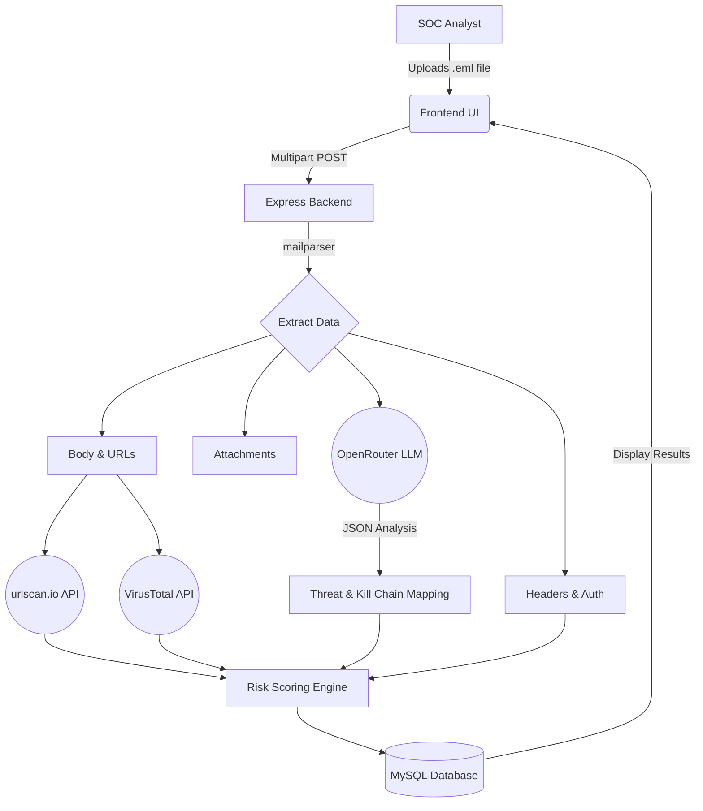

# 🛡️ Phishing Triage & Kill Chain Analyzer

<div align="center">
  
  
  
  
  
</div>

<br />

An advanced, AI-powered internal tool designed for Security Operations Center (SOC) analysts to quickly ingest, analyze, and triage suspicious emails. It maps threats directly to the **Cyber Kill Chain** and **MITRE ATT&CK** frameworks, cross-referencing extracted URLs against **VirusTotal** and **urlscan.io**.

---

## ✨ Key Features

- **🧠 AI-Powered Threat Analysis:** Leverages OpenRouter LLMs to automatically analyze email headers, body content, and metadata to determine threat levels and explain reasoning.
- **🔗 Dual-Source URL Reputation:** Extracts URLs and parallel-checks them against both **VirusTotal** and **urlscan.io**, instantly flagging conflicts or zero-day phishing links.
- **🛡️ Kill Chain Mapping:** Visually maps the attacker's progression on a dynamic Cyber Kill Chain timeline.
- **🔍 Deep Email Parsing:** Automatically extracts and analyzes SPF/DKIM/DMARC authentication results, received chain hops, attachments, and display-name spoofing attempts.
- **💬 Interactive SOC Chatbot:** Query the AI contextually about the specific email you are analyzing.
- **📊 Risk Scoring Engine:** Calculates a 0-100 risk score combining deterministic rules (like missing SPF) with AI confidence weighting.

---

## 🏗️ Architecture & Workflow

The platform follows a rapid triage workflow. Here is how an email `.eml` file is processed:



---

## 🚀 Local Setup & Installation

### 1. Prerequisites
- Node.js (v18 or higher)
- MySQL Server (running on port 3306)
- API Keys for **VirusTotal**, **urlscan.io**, and **OpenRouter**

### 2. Database Initialization
Create a MySQL database (e.g., `phishing_triage`) and run the schema file:
```bash
mysql -u root -p phishing_triage < phishing-triage-backend/schema.sql
```

### 3. Backend Setup
```bash
cd phishing-triage-backend
npm install
```
Rename `.env.example` to `.env` and fill in your credentials:
```env
DB_HOST=localhost
DB_USER=root
DB_PASSWORD=yourpassword
DB_NAME=phishing_triage
PORT=4000
VIRUSTOTAL_API_KEY=your_key
URLSCAN_API_KEY=your_key
OPENROUTER_API_KEY=your_key
```
Start the backend development server:
```bash
npm run dev
```

### 4. Frontend Setup
Open a new terminal window:
```bash
cd phishing-triage-frontend
npm install
```
Start the Vite development server:
```bash
npm run dev
```
Navigate to `http://localhost:5173` in your browser.

---

## ☁️ Deployment Guide (cPanel / Shared Hosting)

<details>
<summary><b>Click to expand full Bengali deployment guide for cPanel</b></summary>

### ১. ডাটাবেস সেটআপ
1. cPanel থেকে **MySQL® Databases**-এ গিয়ে নতুন Database ও User তৈরি করুন।
2. User-কে Database-এর সাথে যুক্ত করে **ALL PRIVILEGES** দিন।
3. **phpMyAdmin**-এ গিয়ে `schema.sql` ফাইলটি ইমপোর্ট করুন।

### ২. ব্যাকএন্ড (Node.js API)
1. লোকাল মেশিনে `phishing-triage-backend` ফোল্ডারে `npm run build` কমান্ড দিন।
2. `dist` ফোল্ডার, `package.json`, এবং `.env` নিয়ে একটি জিপ তৈরি করুন (`node_modules` বাদে)।
3. cPanel File Manager-এ `public_html`-এর বাইরে একটি ফোল্ডার (যেমন `backend`) তৈরি করে জিপটি Extract করুন।
4. cPanel থেকে **"Setup Node.js App"**-এ গিয়ে নতুন অ্যাপ তৈরি করুন। 
   - Root: `backend`
   - Startup file: `dist/index.js`
5. **Run NPM Install** বাটনে ক্লিক করুন এবং লাইভ ডাটাবেস ক্রেডেনশিয়ালসহ `.env` আপডেট করে অ্যাপ **RESTART** করুন।

### ৩. ফ্রন্টএন্ড (React/Vite)
1. `phishing-triage-frontend`-এর `.env` ফাইলে `VITE_API_URL` লাইভ API লিঙ্ক দিন।
2. `npm run build` কমান্ড দিন।
3. `dist` ফোল্ডারের ভেতরের সব ফাইল জিপ করে cPanel-এর `public_html` ফোল্ডারে Extract করুন।
4. React Router-এর জন্য `public_html`-এ একটি `.htaccess` ফাইল তৈরি করে নিচের কোডটুকু দিন:
```apache
<IfModule mod_rewrite.c>
  RewriteEngine On
  RewriteBase /
  RewriteRule ^index\.html$ - [L]
  RewriteCond %{REQUEST_FILENAME} !-f
  RewriteCond %{REQUEST_FILENAME} !-d
  RewriteCond %{REQUEST_FILENAME} !-l
  RewriteRule . /index.html [L]
</IfModule>
```
</details>

---

## 📸 Interactive UI Details

- **Threat Score Gauge:** A dynamic SVG gauge visualizes the calculated risk score (0-100) using a combination of heuristic rules and AI confidence.
- **Source Conflict Detection:** If VirusTotal and urlscan.io disagree on a URL's safety, the UI automatically flags a `⚠️ Sources disagree` warning to alert the analyst.
- **Responsive Tables:** Extracted URLs, metadata, and reputation data are rendered in horizontally-scrollable, fixed-layout tables that gracefully adapt to desktop and mobile workflows.

---

## 📜 License

This project is open-source and available under the [MIT License](LICENSE).
