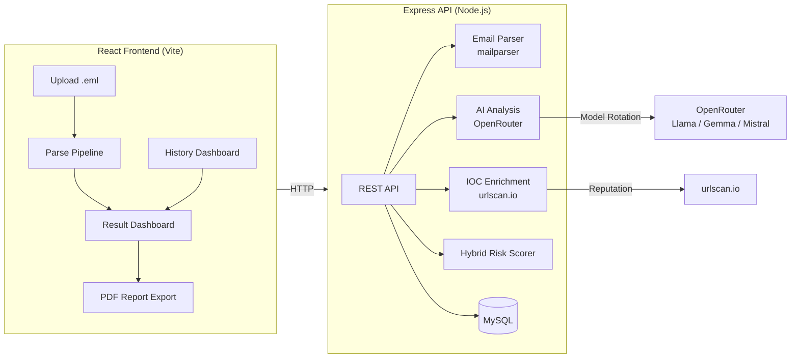

# 🛡️ Phishing Triage & Kill Chain Analyzer

AI-powered email threat analysis platform with **MITRE ATT&CK mapping**, **hybrid risk scoring**, and professional **SOC analyst report generation**.

Upload a `.eml` file → get instant automated triage with authentication checks, IOC enrichment, kill chain stage mapping, and a downloadable analyst report.

---

## 🎯 Problem Statement

SOC analysts spend significant time manually triaging phishing emails — parsing headers, checking authentication results, extracting IOCs, and mapping to threat frameworks. This tool automates the entire triage workflow while maintaining the analyst's ability to explain and audit every finding.

**Key differentiator:** Unlike pure-AI classifiers, this system uses a **hybrid scoring model** — 50% deterministic rule-based signals (SPF/DKIM/DMARC failures, sender spoofing, URL mismatches) + 50% AI verdict (scaled by the model's own confidence). Every score is fully auditable and explainable.

---

## 🏗️ Architecture



---

## ✨ Features

| Feature | Description |
|---|---|
| **Email Parsing** | Headers, authentication results (SPF/DKIM/DMARC), URLs, attachments, received chain |
| **Spoofing Detection** | Reply-To mismatch, display name vs domain mismatch, anchor text vs href mismatch |
| **IOC Enrichment** | URL reputation via urlscan.io (public scan lookup + optional submission) |
| **AI Threat Analysis** | Structured analysis via OpenRouter with automatic model rotation on rate limits |
| **MITRE ATT&CK Mapping** | Kill chain stage + technique ID (e.g., T1566.002) from AI analysis |
| **Hybrid Risk Score** | 0-100 score: rule-based (max 70pts) + AI verdict × confidence (max 50pts) |
| **Kill Chain Timeline** | Visual 7-stage Lockheed Martin kill chain with active stage highlighting |
| **PDF Analyst Report** | One-click downloadable SOC analyst report with all findings and recommendations |
| **History Dashboard** | Paginated list of all analyses with threat level, date, and search filters |

---

## 🔬 MITRE ATT&CK Mapping Approach

The AI model receives structured, pre-parsed email data (not raw HTML/headers) and maps each email to:

1. **Kill Chain Stage** — One of the 7 Lockheed Martin stages (Reconnaissance → Actions on Objectives)
2. **MITRE ATT&CK Technique ID** — e.g., `T1566.001` (Spearphishing Attachment) or `T1566.002` (Spearphishing Link)
3. **Threat Level** — Critical / High / Medium / Low / Benign
4. **Confidence Score** — 0.0 to 1.0 (used to weight the AI's contribution to the final risk score)

The AI is instructed to base verdicts on **concrete evidence** in the data — auth failures, mismatches, risky attachments, URL reputation — not speculation. A clean email should be classified as `benign`, not inflated.

---

## 🚀 Quick Start (Local)

### Prerequisites
- Node.js 18+
- MySQL (XAMPP, Docker, or standalone)

### 1. Backend

```bash
cd phishing-triage-backend
npm install
cp .env.example .env
# Edit .env: set DB_USER, DB_PASSWORD, OPENROUTER_API_KEY
```

Run `schema.sql` in phpMyAdmin or MySQL CLI to create the database:
```bash
mysql -u root -p < schema.sql
```

Start the dev server:
```bash
npm run dev
# → http://localhost:4000
```

### 2. Frontend

```bash
cd phishing-triage-frontend
npm install
npm run dev
# → http://localhost:5173
```

The Vite dev server proxies `/api` requests to `localhost:4000` automatically.

---

## 📦 Production Deployment (cPanel)

1. **MySQL**: Create database + user in cPanel → MySQL Databases. Run `schema.sql` via phpMyAdmin.
2. **Backend**: cPanel → Setup Node.js App → startup file: `dist/index.js`, Node 18+.
3. **Frontend**: Build the frontend and copy to the backend's `public/` folder:
   ```bash
   cd phishing-triage-frontend
   npm run build
   # Copy dist/* to phishing-triage-backend/public/
   ```
4. **Environment**: Set env vars in cPanel Node.js App config (same keys as `.env.production.example`).
5. **Build & restart**:
   ```bash
   cd phishing-triage-backend
   npm install && npm run build
   # Restart via cPanel UI
   ```

The Express server serves both the API (`/api/*`) and the React SPA (all other routes).

---

## 🧮 Risk Score Methodology

```
finalScore = ruleScore × 0.5 + (aiScore × aiConfidence) × 0.5
```

| Component | Max | Source |
|---|---|---|
| **Rule Score** | 70 | SPF fail (+15), DKIM fail (+10), DMARC fail (+15), Reply-To mismatch (+10), Display name mismatch (+15), URL text/href mismatch (+20), Risky attachments (+15 each, max 2), Malicious URL reputation (+25), Many URLs (+5) |
| **AI Score** | 100 | Mapped from threat level: critical=100, high=75, medium=50, low=25, benign=0 |
| **AI Confidence** | 1.0 | Model's self-assessed confidence, used to scale the AI component |

The score is capped at 99.99. The full breakdown is stored and displayed, so you can always explain *why* a score is what it is.

---

## 🛠️ Tech Stack

| Layer | Technology |
|---|---|
| Frontend | React 19, TypeScript, Vite, React Router, vanilla CSS |
| Backend | Express 5, TypeScript, Multer, mailparser |
| Database | MySQL 8+ (mysql2 driver) |
| AI | OpenRouter (Llama 3.1, Gemma 2, Mistral 7B, Qwen 2 — free tier) |
| Enrichment | urlscan.io API |
| PDF Export | html2pdf.js (client-side) |
| Validation | Zod (AI response schema validation) |

---

## 📁 Project Structure

```
project-x/
├── phishing-triage-backend/
│   ├── src/
│   │   ├── index.ts              — Express entry + static serving
│   │   ├── db.ts                 — MySQL connection pool
│   │   ├── types.ts              — Shared TypeScript types
│   │   ├── parser/emailParser.ts — .eml parsing (mailparser)
│   │   ├── routes/
│   │   │   ├── analyze.ts        — POST /api/analyze
│   │   │   ├── analyses.ts       — GET /api/analyses (w/ filters)
│   │   │   └── aiAnalyze.ts      — POST /api/analyses/:id/ai-analyze
│   │   ├── services/
│   │   │   ├── openrouterService.ts — AI + model rotation
│   │   │   └── urlscanService.ts    — IOC enrichment
│   │   └── utils/
│   │       ├── authHeaders.ts    — SPF/DKIM/DMARC parser
│   │       ├── riskScoring.ts    — Hybrid risk scorer
│   │       └── urlExtractor.ts   — URL + mismatch detection
│   ├── schema.sql
│   └── .env.production.example
│
├── phishing-triage-frontend/
│   ├── src/
│   │   ├── api/client.ts         — Typed API client
│   │   ├── components/           — Reusable UI components
│   │   ├── pages/
│   │   │   ├── UploadPage.tsx    — Drag-and-drop upload
│   │   │   ├── ResultPage.tsx    — Full analysis dashboard
│   │   │   └── HistoryPage.tsx   — Filterable analysis history
│   │   ├── App.tsx               — Router
│   │   └── index.css             — Design system
│   └── vite.config.ts
```

---

## 📜 License

MIT

---

*Built as a cybersecurity portfolio project to demonstrate automated phishing triage, MITRE ATT&CK mapping, and hybrid AI+rule-based threat assessment.*
